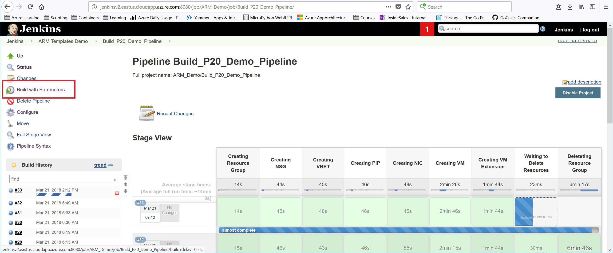
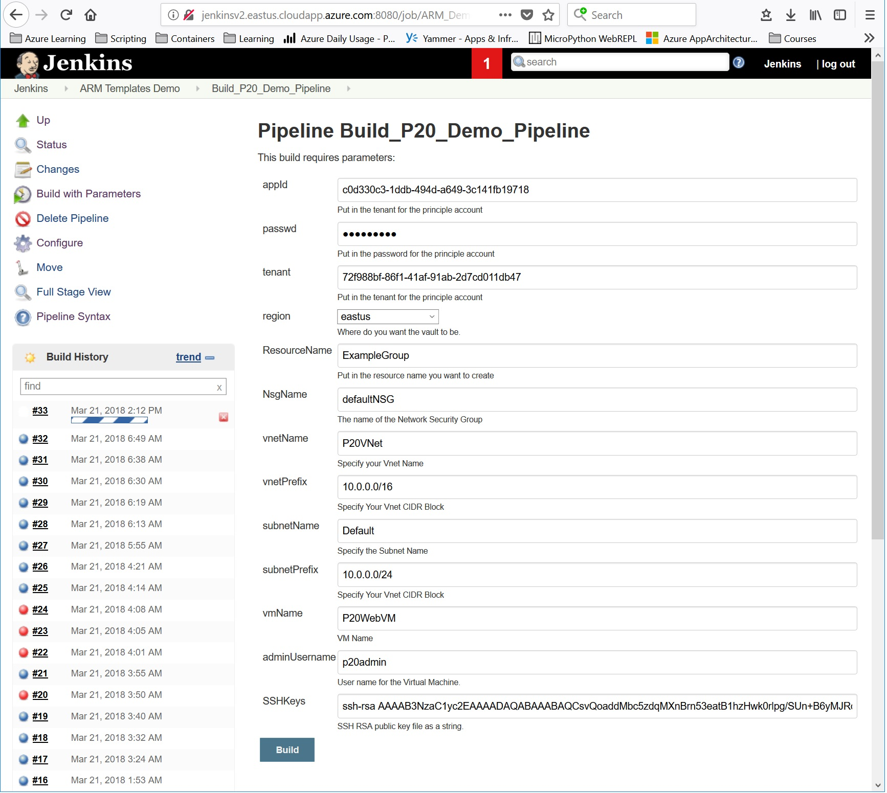
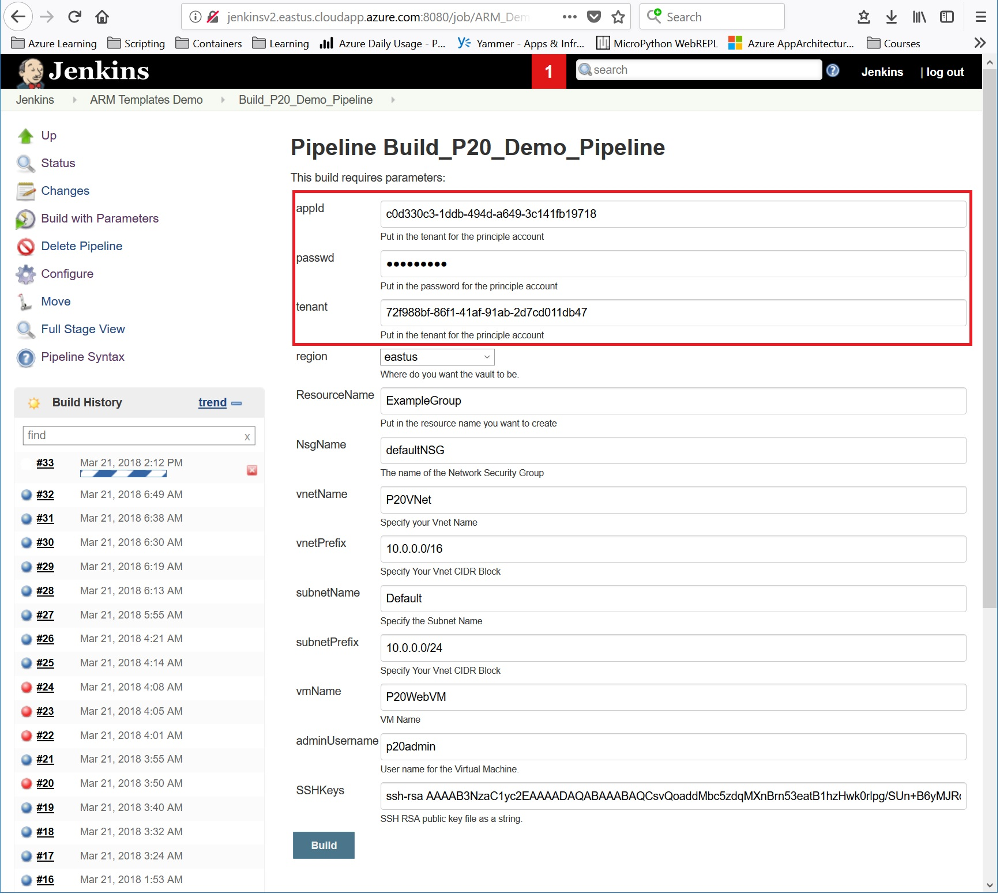
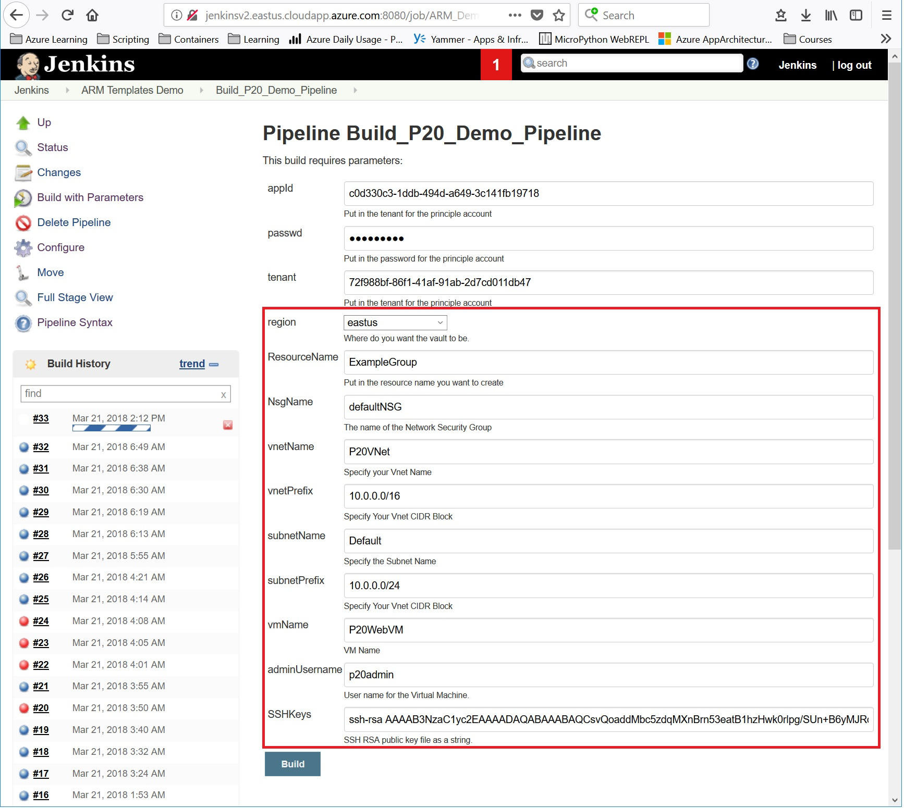
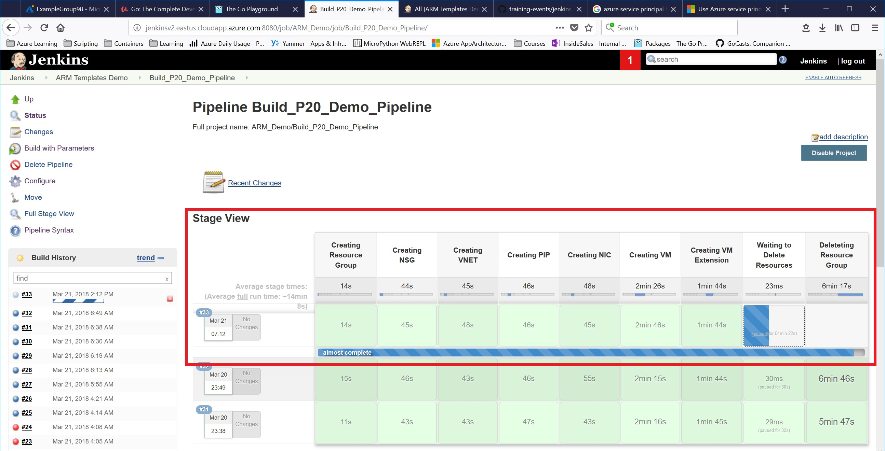
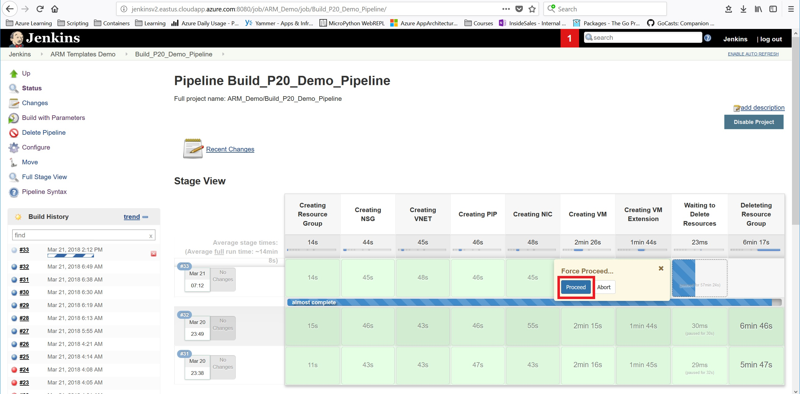

# Jenkins Orchestration

## Prerequisite
Jenkins Server: [Click Here](http://jenkinsv2.eastus.cloudapp.azure.com:8080/job/ARM_Demo/job/Build_P20_Demo_Pipeline/)

UserName : ```Check with alhussai@microsoft.com```

Password: ```Check with alhussai@microsoft.com```

GitHub Repo: [Templates](https://github.com/alihhussain/training-events/tree/master/jenkins)

Service Principal: [How to create](https://docs.microsoft.com/en-us/cli/azure/create-an-azure-service-principal-azure-cli?toc=%2Fazure%2Fazure-resource-manager%2Ftoc.json&view=azure-cli-latest)

## [Pipeline Steps](http://jenkinsv2.eastus.cloudapp.azure.com:8080/job/ARM_Demo/job/Build_P20_Demo_Pipeline/)

1. Creating Resource Group: 
    * [Jenkins Job Link](http://jenkinsv2.eastus.cloudapp.azure.com:8080/job/ARM_Demo/job/Build_RG/)
2.  Creating Network Security Group: 
    * [Jenkins Job Link](http://jenkinsv2.eastus.cloudapp.azure.com:8080/job/ARM_Demo/job/Build_NSG/)   
    * [Template File](https://github.com/alihhussain/training-events/blob/master/jenkins/Build_NSG.json)
    * [Parameter File](https://github.com/alihhussain/training-events/blob/master/jenkins/Build_NSG.parameters.json) 
3. Creating Virtual Network
    * [Jenkins Job Link](http://jenkinsv2.eastus.cloudapp.azure.com:8080/job/ARM_Demo/job/Build_VNET/)   
    * [Template File](https://github.com/alihhussain/training-events/blob/master/jenkins/Build_VNet.json)
    * [Parameter File](https://github.com/alihhussain/training-events/blob/master/jenkins/Build_VNet.parameters.json) 
4. Create a Public Ip Address
    * [Jenkins Job Link](http://jenkinsv2.eastus.cloudapp.azure.com:8080/job/ARM_Demo/job/Build_PIP/)   
    * [Template File](https://github.com/alihhussain/training-events/blob/master/jenkins/Build_PIP.json)
    * [Parameter File](https://github.com/alihhussain/training-events/blob/master/jenkins/Build_PIP.parameters.json)
5. Creating a Network Interface Card
    * [Jenkins Job Link](http://jenkinsv2.eastus.cloudapp.azure.com:8080/job/ARM_Demo/job/Build_NIC/)   
    * [Template File](https://github.com/alihhussain/training-events/blob/master/jenkins/Build_NIC.json)
    * [Parameter File](https://github.com/alihhussain/training-events/blob/master/jenkins/Build_NIC.parameters.json)
6. Creating a Virtual VM
    * [Jenkins Job Link](http://jenkinsv2.eastus.cloudapp.azure.com:8080/job/ARM_Demo/job/Build_VM/)   
    * [Template File](https://github.com/alihhussain/training-events/blob/master/jenkins/Build_VM.json)
    * [Parameter File](https://github.com/alihhussain/training-events/blob/master/jenkins/Build_VM.parameters.json)
7. Run the Custom Extension against the VM
    * [Jenkins Job Link](http://jenkinsv2.eastus.cloudapp.azure.com:8080/job/ARM_Demo/job/Build_VMX/)   
    * [Template File](https://github.com/alihhussain/training-events/blob/master/jenkins/Build_VMX.json)
    * [Parameter File](https://github.com/alihhussain/training-events/blob/master/jenkins/Build_VMX.parameters.json)
8. Wait Job - Will wait 90 minutes before Resources Delete
    * [No Job its part of the pipeline](http://jenkinsv2.eastus.cloudapp.azure.com:8080/job/ARM_Demo/job/Build_P20_Demo_Pipeline/configure)
9. Delete the Resouce Group
    * [Jenkins Job Link](http://jenkinsv2.eastus.cloudapp.azure.com:8080/job/ARM_Demo/job/P20_Delete/)

## Steps to run the Pipeline

1. [Build the pipeline with parameters](http://jenkinsv2.eastus.cloudapp.azure.com:8080/job/ARM_Demo/job/Build_P20_Demo_Pipeline/)


2. [Put in the parameters](http://jenkinsv2.eastus.cloudapp.azure.com:8080/job/ARM_Demo/job/Build_P20_Demo_Pipeline/build?delay=0sec)



3. [Put in your Service Principal Information](http://jenkinsv2.eastus.cloudapp.azure.com:8080/job/ARM_Demo/job/Build_P20_Demo_Pipeline/build?delay=0sec)
    * Put in the following information:
        * ```appId``` - Application ID you got from creating the Service Principal
        * ```passwd``` - The password you gave to the service principal
        * ```tenant``` - Tenant ID of the service principal (You would have gotten this when you created the Service Principal)



4. [Modify build parameters if required](http://jenkinsv2.eastus.cloudapp.azure.com:8080/job/ARM_Demo/job/Build_P20_Demo_Pipeline/build?delay=0sec)
The build parameters that can be changed are:
    * ```region``` - Choose the region to deploy in.
    * ```ResourceName``` - Put in the resource name you want to create
    * ```NsgName``` - The name of the Network Security Group
    * ```vnetName``` - Specify your Virtual Network Name
    * ```vnetPrefix``` - Specify Your Vnet CIDR Block
    * ```subnetName``` - Specify the Subnet Name
    * ```subnetPrefix``` - Specify Your Subnet CIDR Block
    * ```vmName``` - Specify Your Virtual VM Name
    * ```adminUsername``` - User name for the Virtual Machine.
    * ```SSHKeys``` - SSH RSA public key file as a string.
 



5. Once Done Click **Build**


6. See things Run



7. Delete Everything by Force

